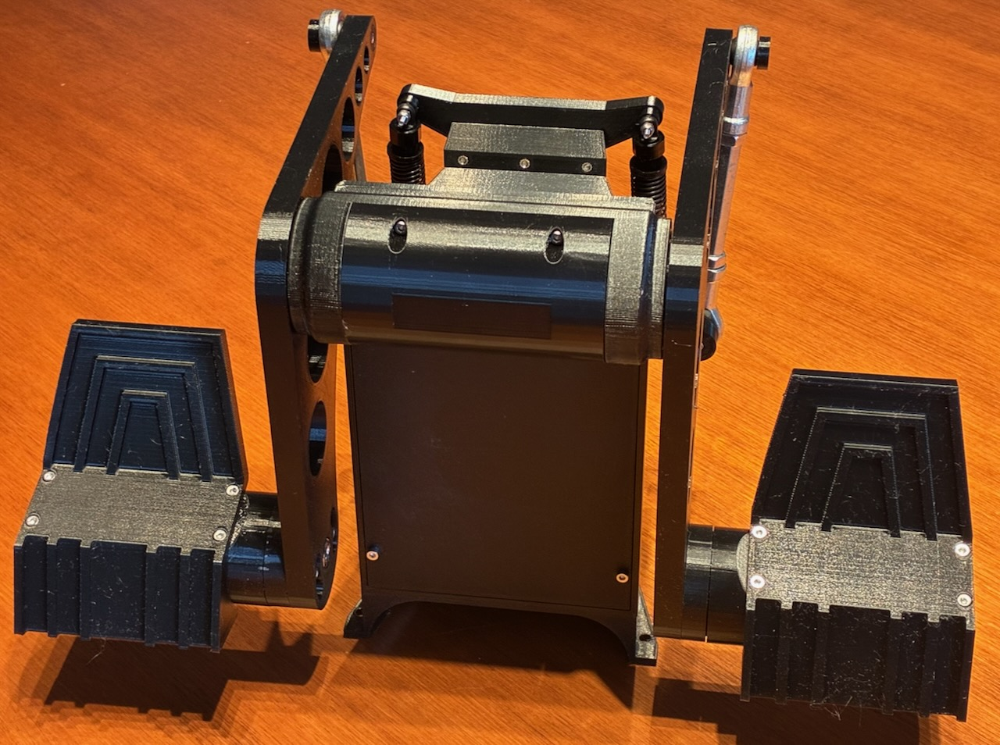

USB Rudder using Raspberry Pi Pico

This is a very short readme because this project is already documented in other places.

3D printed parts can be obtained at [Printables](https://www.printables.com/model/1860677-rudder-pedals-pendular-differential-braking-for-fl)

Code can be obtained here; a longer document about how it works is on [my blog](https://aeberbach.github.io/blog/).

A video about how to put all the parts together: 
